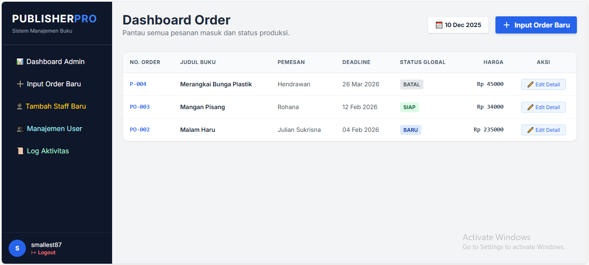

# PublisherPro - Sistem Manajemen Penerbitan Buku 📚


**PublisherPro** adalah aplikasi web terintegrasi berbasis Python/Django yang dirancang sebagai mini-ERP untuk perusahaan penerbitan dan percetakan. Aplikasi ini mendigitalisasi seluruh alur kerja mulai dari pesanan masuk, desain, produksi fisik, hingga pelaporan keuangan dalam satu pintu.


*(Screenshot Dashboard Admin)*

## ✨ Fitur Utama (v1.0 Enterprise)

### 🏢 Manajemen Order & Workflow
* **Multi-Role Dashboard:** Tampilan khusus untuk Admin (Penerima Order), Desainer (Pre-Press), dan Operator (Produksi).
* **Workflow Otomatis:** Status order bergerak sekuensial (Baru -> Layout -> Cetak -> Jilid -> Finishing -> Siap).
* **Privacy Control:** Harga dan data klien disembunyikan dari operator produksi untuk menjaga kerahasiaan dapur perusahaan.

### 💰 Keuangan & Pembayaran
* **Tracking Pembayaran:** Status Belum Bayar, DP (Down Payment), dan Lunas.
* **Kalkulator Otomatis:** Menghitung sisa tagihan/piutang secara *real-time* berdasarkan uang masuk.
* **Indikator Visual:** Label warna-warni pada dashboard untuk menandai order yang belum lunas.

### 🖨️ Dokumen & Laporan (PDF/Excel)
* **Cetak SPK (Surat Perintah Kerja):** Generate PDF otomatis berisi spek teknis untuk tim produksi (tanpa harga).
* **Cetak Invoice:** Generate Invoice profesional untuk tagihan ke klien.
* **Laporan Bulanan:** Ringkasan omzet, uang masuk, dan piutang per bulan.
* **Export Excel:** Unduh data laporan ke format `.xlsx` untuk audit lanjutan.

### 🛡️ Keamanan & Audit
* **Audit Trail (System Log):** Merekam setiap aktivitas user (Input, Edit, Upload, Cetak) beserta waktunya ("CCTV Digital").
* **Manajemen User Terpusat:** Admin dapat menambah karyawan, mengatur divisi, dan memblokir akses akun.
* **Profil Lengkap:** Dukungan foto profil, data diri, dan role user.

---

## 🛠️ Teknologi yang Digunakan

* **Core:** Python 3.10+, Django 5.0
* **Database:** SQLite (Dev), PostgreSQL (Production Ready)
* **Frontend:** HTML5, Tailwind CSS (via CDN)
* **File Processing:**
    * `Pillow` (Manipulasi Gambar/Foto Profil)
    * `xhtml2pdf` (Generasi PDF SPK & Invoice)
    * `openpyxl` (Generasi Laporan Excel)
* **Server:** Gunicorn, Nginx (Untuk Deployment)

---

## 🚀 Instalasi Lokal (Development)

Ikuti langkah ini untuk menjalankan aplikasi di komputer Anda.

### 1. Clone Repository
```bash
git clone [https://github.com/smallest87/AppPenerbitan.git](https://github.com/smallest87/AppPenerbitan.git)
cd AppPenerbitan
````

### 2\. Buat Virtual Environment

```bash
# Windows
python -m venv venv
venv\Scripts\activate

# Mac/Linux
python3 -m venv venv
source venv/bin/activate
```

### 3\. Install Dependencies

Pastikan menginstall seluruh library yang dibutuhkan.

```bash
pip install -r requirements.txt
```

### 4\. Setup Database

```bash
python manage.py makemigrations
python manage.py migrate
```

### 5\. Buat Superuser (Admin)

```bash
python manage.py createsuperuser
```

### 6\. Jalankan Server

```bash
python manage.py runserver
```

Akses aplikasi di: `http://127.0.0.1:8000/`

-----

## 🔐 Panduan Hak Akses (Role)

Sistem ini menggunakan **Django Groups** untuk membatasi akses fitur:

| Role / Group | Akses Dashboard | Fitur Utama |
| :--- | :--- | :--- |
| **Superuser / Penerima Order** | Dashboard Admin | Input Order, Edit Harga, Keuangan, Laporan, Manajemen User, Log Aktivitas. |
| **Pre-Press** | Studio Desain | Upload Layout & Cover, Update Status Desain. |
| **Produksi** | Area Produksi | Lihat SPK, Download Aset, Update Status Cetak/Jilid/Finishing. |

-----

## 🌐 Panduan Deployment (Production)

Panduan singkat untuk deploy ke VPS Ubuntu dengan Nginx + Gunicorn.

1.  **Persiapan Server:**

    ```bash
    sudo apt update && sudo apt install python3-pip python3-venv nginx
    ```

2.  **Setup Gunicorn:**
    Pastikan `gunicorn` terinstall dan buat file service systemd.

    ```bash
    gunicorn --bind unix:/home/ubuntu/AppPenerbitan/app.sock SistemPenerbitan.wsgi:application
    ```

3.  **Setup Nginx:**
    Konfigurasi blok server untuk meneruskan traffic ke Gunicorn dan melayani file static/media.

4.  **Keamanan:**
    Set `DEBUG = False` dan `ALLOWED_HOSTS` di `settings.py`.

-----

## 🤝 Kontribusi

Pull request dipersilakan. Untuk perubahan besar, harap buka issue terlebih dahulu untuk mendiskusikan apa yang ingin Anda ubah.

## 📄 Lisensi

[MIT](https://choosealicense.com/licenses/mit/)

```